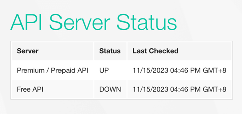

# osogrouptest
Pārbaudes uzdevums - tiešsaistes valūtas kursa kalkulators, izmantojot tehnoloģijas: CodeIgniter3 + vue.js +
Docker (vieglākai testēšanai).

P.S.
API: https://free.currencyconverterapi.com/, kuru JUS norādījāt valūtu saņemšanai, nedarbojas, mēģinot saņemt valūtas, API atbild ar 503 statusu, arī viņu vietnē ir norādīts, ka serveris nedarbojas.

Tāpēc nolēmu izmantot citu API (https://fastforex.readme.io) - saņemu API atslēgu, kas pārstās darboties pēc 5 dienām!

# Projekta uzsākšana dokeri
1. Palaist Docker
2. Ar terminala palidzibu ienakt projektu sakne
3. docker-compose up -d
4. Testesana http://localhost:7700

# Laika patēriņš
1. Uzdevuma analīze, piedāvātās API testēšana, jaunas API meklēšana - 1h
2. Izstrādes vides sagatavošana (Docker) + darbs ar GitHub - 0.5
3. Vue.js dokumentācijas izpēte (jo esmu pilna laika backend un gandrīz neesmu strādājis ar frontend) - 3h
4. CodeIgniter3 izpēte + Backend izstrāde + API - 1.5h
5. Frontend izstrāde - 2.5h

Kopuma ar apmācību patērēts ~9h
